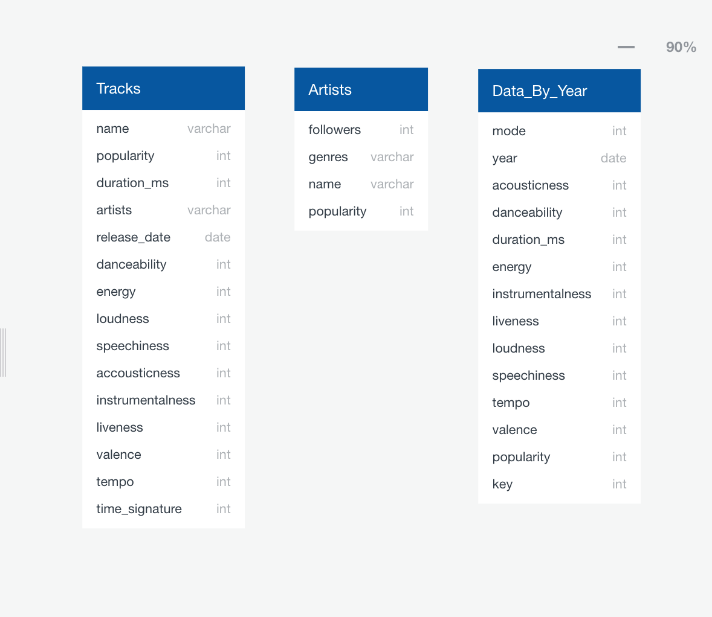

# Song Features Over Time
This project will take the metadata of tracks from spotify across 100 years to analyze how music has changed over time.

## Purpose

This topic was selected after exploring what data Spotify keeps on the music uploaded to its platform.
Spotify classifies music based on the following features:

* id (Id of track generated by Spotify)
* acousticness (Ranges from 0 to 1)
* danceability (Ranges from 0 to 1)
* energy (Ranges from 0 to 1)
* duration_ms (Integer typically ranging from 200k to 300k)
* instrumentalness (Ranges from 0 to 1)
* valence (Ranges from 0 to 1)
* popularity (Ranges from 0 to 100)
* tempo (Float typically ranging from 50 to 150)
* liveness (Ranges from 0 to 1)
* loudness (Float typically ranging from -60 to 0)
* speechiness (Ranges from 0 to 1)
* mode (0 = Minor, 1 = Major)
* explicit (0 = No explicit content, 1 = Explicit content)
* key (All keys on octave encoded as values ranging from 0 to 11, starting on C as 0, C# as 1 and so on…)
* timesignature (The predicted timesignature, most typically 4)
* artists (List of artists mentioned)
* artists (Ids of mentioned artists)
* release_date (Date of release mostly in yyyy-mm-dd format, however precision of date may vary)
* name (Name of the song)

We're curious about how the ratio of these features has changed over time. Are any cyclical trends? How does the breakdown look for different genres, and can we find how new genres are created?
 
## Data Source
We are sourcing our data from the following dataset on Kaggle:

[Spotify Dataset 1922-2021](https://www.kaggle.com/yamaerenay/spotify-dataset-19212020-160k-tracks)

## Project Team Communication Protocol 

* Main communication will be through our Slack channel 
* Meet twice weekly via Zoom
    * Monday & Wednesday 7-9pm
* Add additional zoom meetings if needed
    * Thurs-Sun timeframe

## Database
We are using Amazon RDS Database to store our data. The DB identifier is spotify at the following webiste:

[Spotify Databse](https://us-east-2.console.aws.amazon.com/rds/home?region=us-east-2#databases:)

The following image is the logical ERD that will serve as the model for our database:

## Machine Learning

The unsupervised hierarchical clustering is a feasible machine learning algorithm that can be used to breakdown and organize genres in the Spotify Track Database.
A dendrogram could be useful to identify the appropriate number of clusters or genres by identifying tracks that are similar based on key characteristics, such as acousticness, danceability, energy, etc.

Example of dendrogram:

To run the hierarchical clustering algorithm, we can run Agglomerative Clustering from Scikit Learn package and use the cluster number identified in the the dendrogram. 
[Pseudo Code for algorithm](https://github.com/caseykotowski/Song-Features-Over-Time/blob/6e4e8af93799df650a785f97095db41907ec8f09/Pseudo_Code_S1_Machine_Learning.ipynb)

This algorithm can possibly used to predict how a song will be categorized in genre. 

